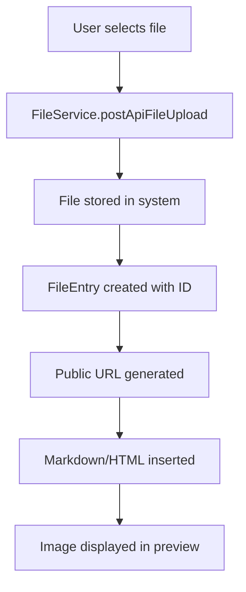

# File Upload Integration with FileService

## Overview

The enhanced markdown editors now integrate directly with the consolidated API's FileService for secure, public file uploads. This replaces the previous form-based upload system with a more robust and efficient approach.

## Technical Implementation

### FileService Integration

```typescript
// Upload using FileService
import { FileService } from '@/api/consolidated';
import { configureConsolidatedAPI } from '@/lib/consolidatedApi';

const handleImageUpload = async (file: File) => {
  // Configure API with JWT
  configureConsolidatedAPI(jwt);
  
  // Upload file
  const formData = { File: file };
  const result = await FileService.postApiFileUpload(formData);
  
  if (result.outcome === 'Success' && result.data) {
    // Create public URL
    const fileId = result.data.id;
    const publicUrl = `${API_BASE}/api/file/${fileId}`;
    return publicUrl;
  }
};
```

### Public File Access

Files uploaded through the FileService are automatically accessible via public URLs:

```
https://your-api-domain.com/api/file/{fileId}
```

This enables:
- ✅ **Direct embedding** in markdown content
- ✅ **Public access** without authentication
- ✅ **CDN compatibility** for performance
- ✅ **Proper content types** and headers

### Integration Points

#### 1. Direct Markdown Editor
- **Upload Method**: Drag & drop or click to upload
- **Insertion**: Automatic markdown syntax generation
- **Format**: ``

#### 2. Rich Text Editor (TipTap)
- **Upload Method**: Toolbar button or drag & drop
- **Insertion**: Direct image node insertion
- **Format**: HTML `` tag with public URL

## File Upload Flow



## Updated Upload Utility

The `lib/upload.ts` has been updated to use FileService:

```typescript
export async function uploadFileViaAPI(jwt: string, file: File): Promise<string> {
  configureConsolidatedAPI(jwt);
  
  const formData = { File: file };
  const result = await FileService.postApiFileUpload(formData);
  
  if (result.outcome === 'Success' && result.data) {
    const fileId = result.data.id;
    return `${process.env.NEXT_PUBLIC_API_BASE}/api/file/${fileId}`;
  }
  
  throw new Error(result.message || 'Upload failed');
}
```

## Security & Permissions

### Authentication
- **JWT Required**: File uploads require valid JWT token
- **User Context**: Files are associated with the uploading user
- **Rate Limiting**: API handles upload rate limiting

### Public Access
- **No Auth Required**: Public URLs work without authentication
- **Direct Access**: Files can be embedded in external sites
- **Content Types**: Proper MIME types are preserved

## Supported File Types

The FileService supports various file types:
- **Images**: PNG, JPEG, GIF, WebP, SVG
- **Documents**: PDF, DOC, DOCX (if configured)
- **Other**: Based on API configuration

## Error Handling

```typescript
try {
  const publicUrl = await uploadFileViaAPI(jwt, file);
  // Handle success
} catch (error) {
  if (error.message.includes('file size')) {
    // Handle file too large
  } else if (error.message.includes('file type')) {
    // Handle unsupported file type
  } else {
    // Handle general upload error
  }
}
```

## Benefits Over Previous System

### Before (Form-based upload)
- ❌ Required form seeding with placeholder IDs
- ❌ Complex base64 conversion process
- ❌ Limited file type support
- ❌ No direct public access

### After (FileService integration)
- ✅ **Direct API integration** with proper endpoints
- ✅ **Native file handling** without conversion
- ✅ **Public URLs** for immediate access
- ✅ **Better error handling** and validation
- ✅ **Scalable architecture** for future needs

## Configuration

### Environment Variables
```env
NEXT_PUBLIC_API_BASE=https://your-api-domain.com
```

### API Configuration
The FileService is automatically configured when you call:
```typescript
configureConsolidatedAPI(jwt);
```

This sets:
- Base URL from environment
- JWT authentication
- Proper headers and credentials

## Usage Examples

### In Direct Markdown Editor
```typescript
// Automatic insertion after upload

```

### In Rich Text Editor
```typescript
// TipTap image node
editor.chain().focus().setImage({ 
  src: 'https://api.domain.com/api/file/12345' 
}).run();
```

## Future Enhancements

- **Image optimization**: Automatic resizing and compression
- **Multiple formats**: Generate different sizes for responsive images
- **Upload progress**: Real-time upload progress indicators
- **Bulk uploads**: Support for multiple file uploads
- **File management**: UI for managing uploaded files
